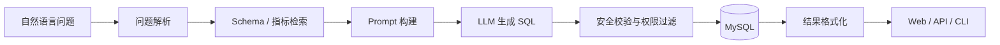

# ChatBI MVP

一个面向业务分析场景的轻量级 Text-to-SQL 项目：用户用自然语言提问，系统结合数据库 Schema、指标知识与业务规则生成只读 SQL，并返回可视化表格结果。

> 当前为 MVP / 学习项目，请勿直接用于生产环境或连接高权限数据库账号。

## 功能亮点

- 自然语言转 SQL，支持命令行、REST API 与 SSE 流式输出
- Schema Linking 与指标 RAG，按问题动态召回相关表、字段和指标定义
- Few-shot 示例、业务规则和多表 Join 辅助，提高 SQL 生成准确率
- 只读 SQL 校验、角色权限、行级过滤与敏感字段脱敏
- 内置简洁 Web 页面，可直接查看生成的 SQL 和查询结果

## 工作流程



## 快速开始

要求：Python 3.12+、MySQL，以及一个 OpenAI 兼容的模型服务。

```bash
# 1. 安装依赖
uv sync

# 2. 配置环境变量
cp .env.example .env

# 3. 启动服务
uv run uvicorn api_service:app --reload
```

启动后访问：

- Web 页面：<http://localhost:8000/static/index.html>
- API 文档：<http://localhost:8000/docs>
- 健康检查：<http://localhost:8000/health>

也可以直接使用命令行：

```bash
uv run python main.py "上个月销售额是多少？"
```

## 配置说明

复制 `.env.example` 后，至少填写以下配置：

```env
OPENAI_API_KEY="your_openai_api_key"
OPENAI_BASE_URL="https://api.openai.com/v1"
LLM_MODEL="your_llm_model"
EMBEDDING_MODEL="text-embedding-3-large"

DB_HOST="localhost"
DB_PORT="3306"
DB_USER="root"
DB_PASSWORD="your_mysql_password"
DB_NAME="chatbi_mvp"
```

建议为项目单独创建仅有 `SELECT` 权限的数据库账号。若启用 Schema Linking 或指标 RAG，可分别运行 `uv run python -m chatbi.schema_linker`、`uv run python -m chatbi.indicator_retriever` 初始化或重建本地向量索引。

## API 示例

```bash
curl -X POST http://localhost:8000/api/v1/query \
  -H "Content-Type: application/json" \
  -d '{"question":"按产品线统计本月销售额"}'
```

流式查询使用 `POST /api/v1/query/stream`。用户角色可通过 `X-User-Role`、`X-User-Region` 请求头传入。

## 测试

```bash
uv run pytest -q
```

## 技术栈

Python · FastAPI · OpenAI API · MySQL · ChromaDB · LangChain · 原生 HTML/CSS/JavaScript

## 说明

本项目参考了 [Vanna](https://github.com/vanna-ai/vanna) 与 [Dataherald](https://github.com/Dataherald/dataherald) 等开源 Text-to-SQL 项目的 README 组织方式，重点保留项目定位、核心能力、快速开始和安全提示。
