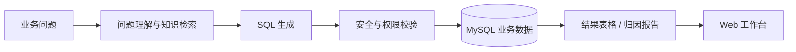

# ChatBI 智能数据分析平台

ChatBI 是一个面向业务分析的自然语言数据查询项目。用户在工作台提问，系统结合数据库结构、指标定义与业务规则生成 SQL，展示查询过程和结果；对于“为什么下降”一类问题，还可以拆解分析步骤并生成归因报告。

## 技术栈

Python 3.12 · FastAPI · MySQL · SQLite · ChromaDB · OpenAI 兼容 API · React · TypeScript · Ant Design

## 核心能力

- **自然语言查询**：将业务问题转为 SQL，支持流式展示生成过程、结果表格和会话追问。
- **归因分析**：拆解复杂问题、执行多个子查询，并汇总分析结论。
- **业务知识检索**：按需检索 Schema、指标定义和示例，辅助 SQL 生成。
- **数据访问控制**：登录鉴权、只读 SQL 校验、角色权限、行级过滤与敏感字段脱敏。
- **Web 工作台**：集中管理会话、查看 SQL、查询结果与分析报告。

## 工作流程


```mermaid
flowchart LR
    A[业务问题] --> B[问题理解与知识检索]
    B --> C[SQL 生成]
    C --> D[安全与权限校验]
    D --> E[(MySQL 业务数据)]
    E --> F[结果表格 / 归因报告]
    F --> G[Web 工作台]
```

前端使用 React 和 TypeScript，后端由 FastAPI 提供 REST 与 SSE 接口。业务数据保存在 MySQL；账户和会话记录分别保存在独立的 SQLite 数据库中。


## 快速开始

需要 Docker Compose，以及一个兼容 OpenAI API 的模型服务。复制 `.env.example` 为 `.env`，填写 `OPENAI_API_KEY`、`OPENAI_BASE_URL`、`LLM_MODEL`、`EMBEDDING_MODEL`、`DB_PASSWORD` 和 `JWT_SECRET`，然后启动：

```bash
docker compose up --build
```

打开 [Web 工作台](http://localhost:8080)；[API 文档](http://localhost:8000/docs)和[健康检查](http://localhost:8000/health)也可直接访问。Compose 首次启动时会导入 `docker/mysql/init/` 中的示例业务数据。

也可以在本地分别运行前后端（需要 Python 3.12+、Node.js 和 MySQL）：

```bash
uv sync
uv run uvicorn api_service:app --reload
```

另开终端：

```bash
cd frontend
npm install
npm run dev
```

本地前端地址为 <http://localhost:3000>。前端 API 地址可在 `frontend/public/config.js` 中配置；Docker 部署使用同源反向代理。

### 账户授权

首次启动后，可运行账户初始化脚本，创建默认管理员（账号和密码均为 `admin`）：

```bash
# Docker Compose
docker compose exec backend python -m chatbi.tools.init_admin

# 本地运行
uv run python -m chatbi.tools.init_admin
```

脚本写入独立的 SQLite 账户库 `data/users.db`，密码以哈希形式保存；重复运行不会覆盖已有的 `admin` 账号。默认凭据仅用于本地演示，不应直接用于公开部署。

其他用户可以在登录页注册。新账号默认为 `pending`，需要管理员在 `sys_user` 表中授予 `admin`、`finance` 或 `sales` 角色后才能登录；`sales` 角色还需要设置 `region`。当前版本尚未提供管理员审批页面。

## Text-to-SQL 评测

2026-10-02 使用当前代码、50 道示例业务问题、已配置的模型服务与 MySQL 重新运行评测。评测将生成 SQL 和参考 SQL 分别执行，以结果是否等价作为主要指标：

| 指标 | 结果 |
| --- | ---: |
| 执行结果正确 | 42 / 50（84.0%） |
| 简单问题 | 14 / 15（93.3%） |
| 中等问题 | 14 / 20（70.0%） |
| 复杂问题 | 14 / 15（93.3%） |
| SQL 执行失败 | 0 |
| 执行成功但结果不匹配 | 8 |

本次运行的[完整评测报告](reports/evaluation_report.md)包含逐题结果。评测命令为 `uv run python -m chatbi.tools.evaluator --report reports/evaluation_report.md`。这组数字反映当前示例数据与评测题集上的 SQL 生成表现，不代表任意业务数据库上的准确率。


## 项目结构

```text
frontend/              React Web 工作台
src/chatbi/
├── analysis/           复杂问题拆解、执行计划与报告生成
├── api/                FastAPI 路由、鉴权与数据模型
├── core/               配置、安全策略与账户管理
├── infrastructure/     数据库、大模型与会话存储
├── retrieval/          Schema 和指标检索
├── services/           查询与分析业务流程
├── text2sql/           问题处理、Prompt 与结果格式化
└── tools/              评测工具
tests/                 后端自动化测试
docker/                容器配置与示例数据初始化
```
